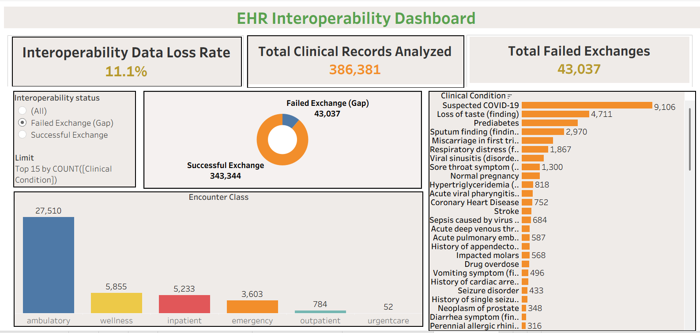

# 🏥 EHR Interoperability & Clinical Data Loss Analysis

## 📌 Executive Summary
In modern healthcare, hospitals operate using two distinct languages: the clinical terminology used by doctors to document patient care (**SNOMED CT**), and the administrative codes used by billing systems and insurance companies (**ICD-10-CM**). When these systems fail to communicate, hospitals face critical blind spots that lead to revenue leakage, delayed insurance claims, and fragmented longitudinal patient care. 

This project explores this exact operational bottleneck. By engineering a custom **OMOP (Observational Medical Outcomes Partnership)** crosswalk in SQL Server, I analyzed hundreds of thousands of synthetic EHR records to quantify and visualize the exact interoperability gap between clinical reality and financial billing.

## 🛠️ Technical Architecture & Methodology

**1. Data Engineering & Pipeline Build (SQL Server)**
* Extracted and cleaned a robust Synthea dataset comprising over 380,000 clinical encounters.
* Engineered a dynamic translation dictionary (`snomed_to_icd10`) using advanced SQL `JOIN` logic against the OMOP standardized vocabulary to map source clinical codes to their billing targets.
* Handled real-world data quality issues by writing deduplication queries and aggregation functions (`MAX()`, `GROUP BY`) to resolve synonym splits and synthetic data artifacts.
* Generated a flat, highly optimized Master Extract (CSV) bridging patient demographics, encounter context, and mapped clinical outcomes.

**2. Data Visualization & Storytelling (Tableau)**
* Developed an interactive, full-scale dashboard designed for hospital administrators and data science teams.
* Utilized dual-axis charts and dynamic parameter filtering to allow users to drill down from high-level KPIs to row-level patient impact.

## 📊 Key Analytical Insights

* **The Interoperability Gap Rate:** Discovered an **11.14% failure rate** in automated code mapping, representing over 43,000 specific clinical events that fell through the interoperability cracks.
* **Clinical Risk Isolation:** Identified the Top 15 specific diseases driving the data loss (e.g., Suspected COVID-19, Prediabetes), highlighting exactly which patient populations are most at risk of having their medical history fractured.
* **Operational Bottlenecks:** Mapped the failures against hospital departments, revealing how different care settings (Inpatient vs. Ambulatory) impact documentation translation success.

## 💻 Skills Demonstrated
* **Database Architecture:** Relational database management, complex table joins, subqueries, and data normalization.
* **Data Science & Analytics:** Root-cause analysis, process defect quantification (Lean Six Sigma principles), and cross-walking disparate datasets.
* **Visualization:** Dashboard UI/UX, KPI development, and calculated fields in Tableau.
* **Healthcare Informatics:** Deep understanding of EHR data structures, SNOMED CT, ICD-10-CM, and the OMOP Common Data Model.

## 📂 Repository Contents
* `EHR_OMOP_Mapping.sql`: The backend SQL scripts used for data cleaning, dictionary creation, and generating the Master Extract.
* `Interoperability_Dashboard.twbx`: The packaged Tableau workbook containing the interactive visualization.
* `EHR_Master_Extract.csv`: The optimized flat file output powering the Tableau engine.
* `dashboard_screenshot.png`: High-resolution capture of the final dashboard.
